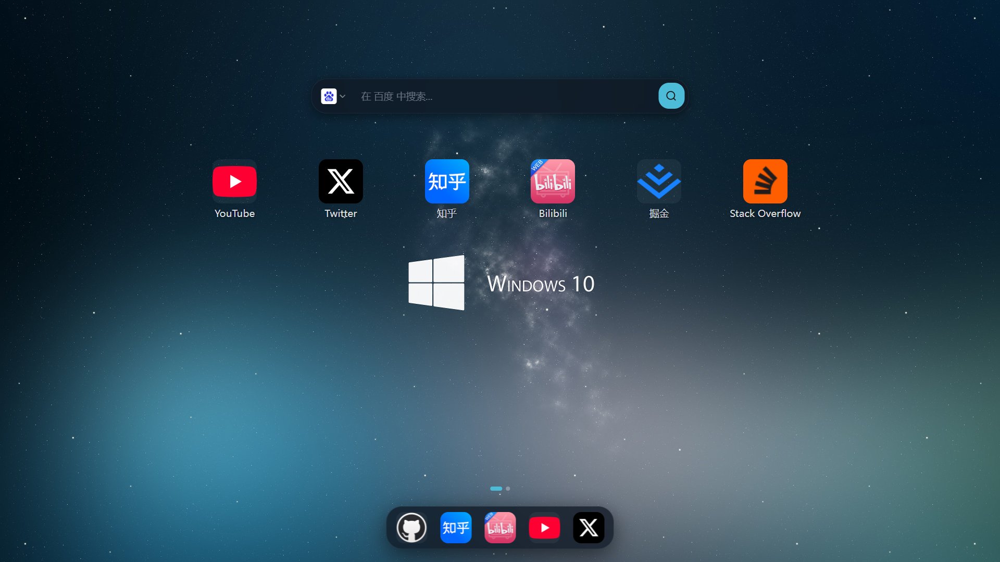
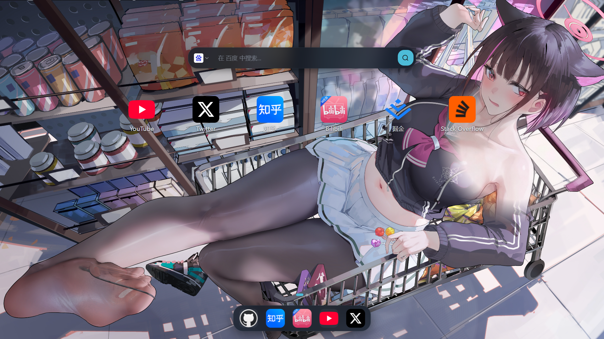
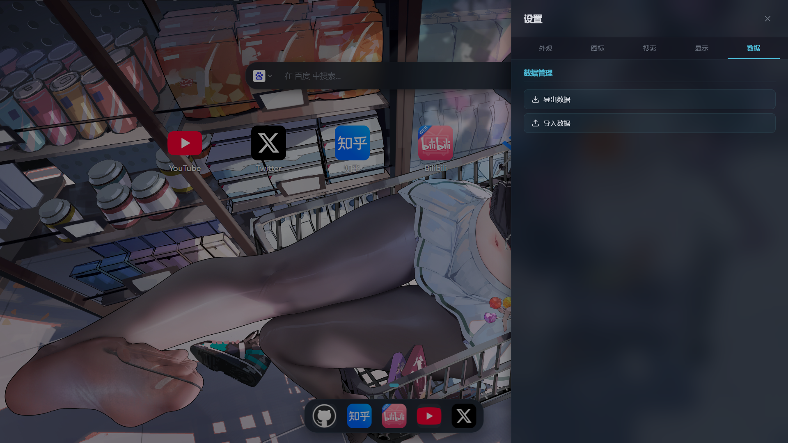
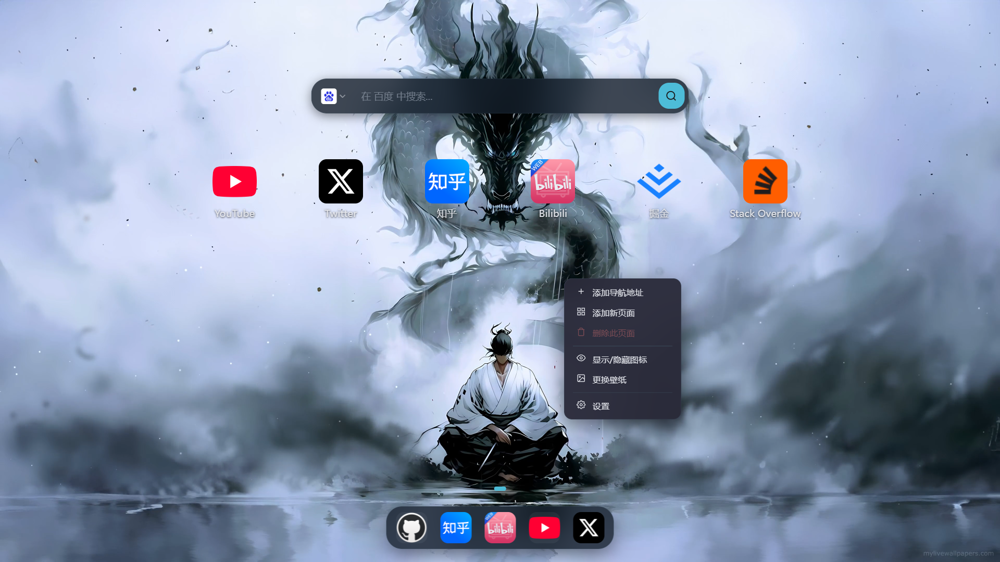
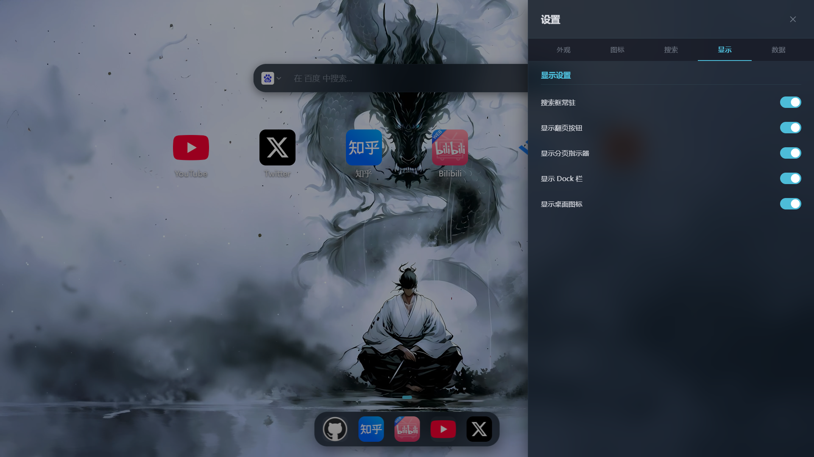
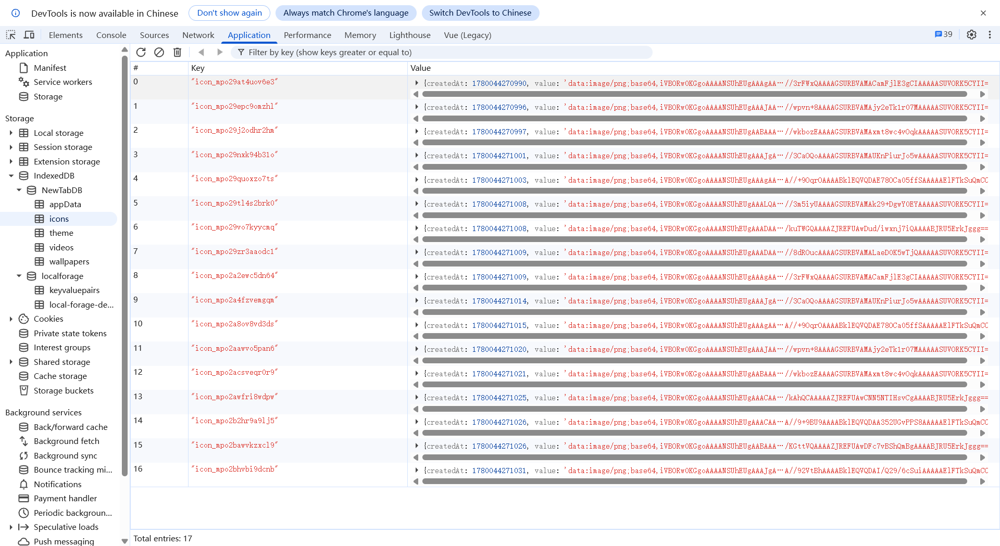
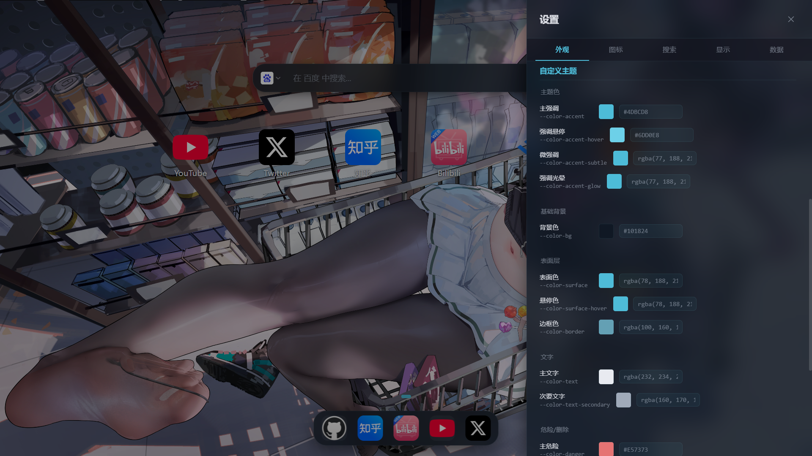

# Nav Plugin - macOS 风格新标签页

一个基于 WXT + Vue 3 开发的浏览器扩展，将新标签页打造为 macOS 桌面风格。支持双层动态壁纸、智能搜索、桌面图标管理等功能，同时提供高度可定制的外观和行为选项（自定义图标大小、网格行列数、主题切换、灵活布局等）。所有数据均保存在浏览器本地 storage 中，不会上传到任何服务器，支持一键导入导出配置数据，您的数据完全由您掌控。

## ✨ 特性

- 🎨 **双层动态壁纸** - 支持单图、随机图库、双层遮罩等多种背景模式
- 🔍 **智能搜索栏** - 集成多搜索引擎(Google、Bing、百度、DuckDuckGo),快速切换
- 📱 **桌面图标管理** - 类似 macOS 的桌面图标布局,支持多页面切换
- 🚀 **Dock 栏** - 底部快捷访问栏,常用网站一键直达
- 🎯 **图标自动获取** - 自动获取网站 favicon,支持自定义上传
- 🌙 **主题切换** - 支持亮色/暗色主题
- 💾 **数据持久化** - 使用浏览器 storage API,数据本地保存

## 📦 安装

### 开发环境

```bash
# 安装依赖
npm install

# 开发模式 (Chrome)
npm run dev

# 开发模式 (Firefox)
npm run dev:firefox
```

### 构建生产版本

```bash
# 构建 Chrome 扩展
npm run build

# 构建 Firefox 扩展
npm run build:firefox

# 打包为 zip
npm run zip
npm run zip:firefox
```

### Web 版本

```bash
# 开发 Web 版本
npm run dev:web

# 构建 Web 版本
npm run build:web
```

## 🎯 使用方式

1. 安装扩展后,打开浏览器新标签页
2. 点击桌面空白区域添加图标,或使用扩展弹窗快速添加当前页面
3. 右键点击图标可编辑、删除或移动位置
4. 底部 Dock 栏可固定常用网站
5. 点击右上角设置按钮自定义外观和行为

## 🛠️ 技术栈

- **框架**: [WXT](https://wxt.dev/) - 现代化浏览器扩展开发框架
- **UI**: [Vue 3](https://vuejs.org/) - 渐进式 JavaScript 框架
- **语言**: TypeScript
- **构建**: Vite
- **浏览器 API**: Chrome Extensions API / WebExtensions API

## 📁 项目结构

```
wxt-version/
├── composables/          # Vue 组合式函数
│   ├── useBackground.ts  # 背景管理
│   ├── useSearch.ts      # 搜索功能
│   ├── useDesktop.ts     # 桌面图标管理
│   ├── useDock.ts        # Dock 栏管理
│   └── ...
├── entrypoints/          # 扩展入口点
│   ├── newtab/          # 新标签页
│   │   ├── components/  # Vue 组件
│   │   └── App.vue      # 主应用
│   ├── popup/           # 扩展弹窗
│   ├── background.ts    # 后台脚本
│   └── content.ts       # 内容脚本
├── public/              # 静态资源
│   ├── icon/           # 扩展图标
│   └── default.json    # 默认配置
├── types/              # TypeScript 类型定义
└── utils/              # 工具函数
```

## 🎨 自定义配置

### 背景设置

- **单图模式**: 设置单张背景图片
- **随机图库**: 从图库中随机切换背景
- **双层遮罩**: 上层图片遮罩下层背景,鼠标交互产生刮开效果

### 搜索引擎

默认集成以下搜索引擎,可在设置中调整顺序和默认引擎:

- Google
- Bing
- 百度
- DuckDuckGo

### 图标管理

- 自动获取网站 favicon
- 支持上传自定义图标
- 支持拖拽调整位置
- 支持多页面分组

## 效果图
















---

**如果您觉得不错，请作者一杯咖啡，感谢您的支持！**


## 🤝 贡献

欢迎提交 Issue 和 Pull Request!
